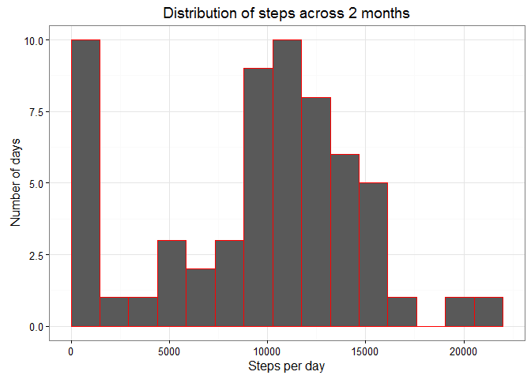

# Reproducible Research: Peer Assessment 1


## Loading and preprocessing the data


```r
library(ggplot2)
library(plyr); library(dplyr)
library(lubridate)
activity <- read.csv("activity.csv", header = TRUE, stringsAsFactors = FALSE)
activity$date <- as.POSIXct(activity$date, format = "%Y-%m-%d")
perday <- summarize(group_by(activity, date),total = sum(steps, na.rm = TRUE))
```

## What is mean total number of steps taken per day?


```r
cat("Mean:", mean(perday$total, na.rm = TRUE))
```

```
Mean: 9354.23
```

```r
cat("Median:", median(perday$total, na.rm = TRUE))
```

```
Median: 10395
```

```r
ggplot(data = perday, aes(perday$total)) +
  geom_histogram(width = 2, bins = 15, col = "red") +
  theme_bw() +
  labs(x = "Steps per day", 
       y = "Number of days", 
       title = "Distribution of steps across 2 months") +
  xlim(c(0, 22000))
```

 


## What is the average daily activity pattern?


```r
pattern <- activity %>% 
  group_by(interval) %>% 
  summarize(avg = mean(steps, na.rm = TRUE))
ggplot(data = pattern, aes(x = interval, y = avg)) +
  geom_line() +
  theme_bw() +
  xlim(c(0, 2355)) +
  labs(title = "Average daily pattern", x = "Time interval", y = "Steps")
```

 

```r
print("The 5 minute interval with the maximum average value was:")
```

```
[1] "The 5 minute interval with the maximum average value was:"
```

```r
print(filter(pattern, avg == max(avg)))
```

```
Source: local data frame [1 x 2]

  interval      avg
     (int)    (dbl)
1      835 206.1698
```

## Imputing missing values
#####If there is an NA, I will just the average value for that interval.

```r
cat("Number of rows with NAs is", sum(is.na(activity)))
```

```
Number of rows with NAs is 2304
```

```r
#create new dataframe that will have impuned values
impune <- activity
#calculated average values for time intervals, to use for impuning
perint <- summarize(group_by(activity, interval), 
                    total = sum(steps, na.rm = TRUE), 
                    avg = mean(steps, na.rm = TRUE))
#for loop, to impune values in new dataset
for(i in 1:nrow(impune)){
  if(is.na(impune$steps[i])){
    impune$steps[i] <- perint$avg[which(impune$interval[i] == perint$interval)]
  }
}
perdayimpune <- summarize(group_by(impune, date),total = sum(steps))
ggplot(data = perdayimpune, aes(perdayimpune$total)) +
  geom_histogram(width = 2, bins = 15, col = "red") +
  theme_bw() +
  labs(x = "Steps per day", 
       y = "Number of days", 
       title = "Distribution of steps across 2 months, with missing data impuned") +
  xlim(c(0, 22000))
```

 

```r
cat("New mean:", mean(perdayimpune$total, na.rm = TRUE))
```

```
New mean: 10766.19
```

```r
cat("New median:", median(perdayimpune$total, na.rm = TRUE))
```

```
New median: 10766.19
```

```r
print("After impuning missing data with this method, both mean and median steps taken per day go up.")
```

```
[1] "After impuning missing data with this method, both mean and median steps taken per day go up."
```


## Are there differences in activity patterns between weekdays and weekends?


```r
impune$dow <- 0
impune$weekend <- 0
#a for loop to add in days of week
for(i in 1:nrow(impune)){
  impune$dow[i] <- wday(impune$date[i], label = TRUE, abbr = FALSE)
  ifelse(impune$dow[i] == 1 | impune$dow[i] == 7, impune$weekend[i] <- TRUE, impune$weekend[i] <- FALSE)
}
#for day of the week, 1 is Sunday, 7 is Saturday

#here I'm going to create two dataframes containing the averages for weekdays and weekends respectively, then I'll rbind them together, after cbinding in something to let me distinguish between them

MonFriavg <- filter(impune, weekend == TRUE) %>% 
  group_by(interval) %>% 
  summarize(avg = mean(steps, na.rm = TRUE))

SatSunavg <- filter(impune, weekend == FALSE) %>% 
  group_by(interval) %>% 
  summarize(avg = mean(steps, na.rm = TRUE))

allavg <- rbind(
  cbind(MonFriavg, dow = "Weekday"),
  cbind(SatSunavg, dow = "Weekend")
)

ggplot(allavg, aes(x = interval, y = avg)) +
  facet_wrap(~dow, nrow = 1) +
  geom_line()+
  theme_bw() +
  labs(x = "Interval", 
       y = "Number of steps per interval", 
       title = "How activity differs from weekdays to weekends")
```

 
